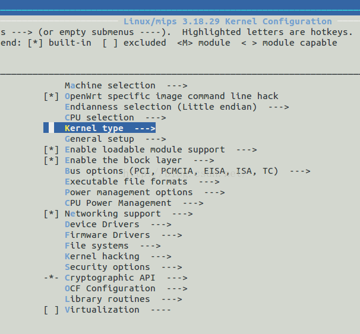
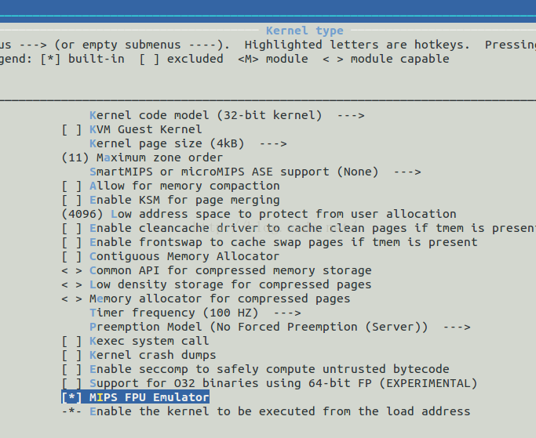

kcptun\_miniexecutable使用方法

基于golang1.8编译，速度比go1.4.2+gomips32编译出来的快一倍。

执行文件体积做到1M。
新添加了frpc_miniexecutable for openwrt.
执行文件体积做到1M。
需要OPENWRT/LEDE平台打开MIPS FPU Emulator。

1在openwrt的SDK目录下，运行命令“make kernel\_menuconfig”, 选择配置“kernel
type”，如下图所示。

2、在"kernel type"中，选中"MIPS FPU Emulator"，如下图所示。

 选择MIPS FPU Emulator

More details please refer to <https://github.com/xtaci/kcptun>

luci-app-kcptun please refer to <https://github.com/kuoruan/luci-app-kcptun>
